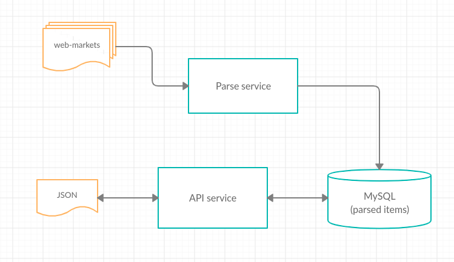

# Wardrobe
Бэкенд для мобильного приложения.

Приложение для подбора одежды, соответственно нужен сервис с базой, которая содержит одежду, обувь, акссесуары и прочее.

После нескольких переписываний было решено разбить сервис на несколько микросервисов, т.к. в приложении есть как минимум 2 почти независимых блока:
* сервис парсинга, наполняющий базу и обновляющий данные (раз в сутки проходить по всем страницам сайта-источника и обновлять данные в базе)
* сервис предоставляющий API к базе.
Блок-схема представлена ниже.

По API:

     запросы:
         https://%root%/items/shoes
         https://%root%/items/clothes
         https://%root%/items/accs
 
     параметры запроса(paging):
         page = номер страницы
         size = количество элементов на странице
         sort = сортировка id, price, desc
         DESC/ASC - по убыванию/возрастанию
 
     тело запроса(фильтр)
         {
           "id": 10, //ИД (число)
           "min": 10, //минимальная цена(число)
           "max": 10, //максимальная цена(число)
           "sex": "MAN", //пол(MAN/WOMAN)
           "brand": [                    //бренды
               "название бренда",
               "название бренда"
             ]
         }
 P.S. Использование этого кода или его фрагментов прямо или косвенно в коммерческих целях запрещено. А то а-та-та (=